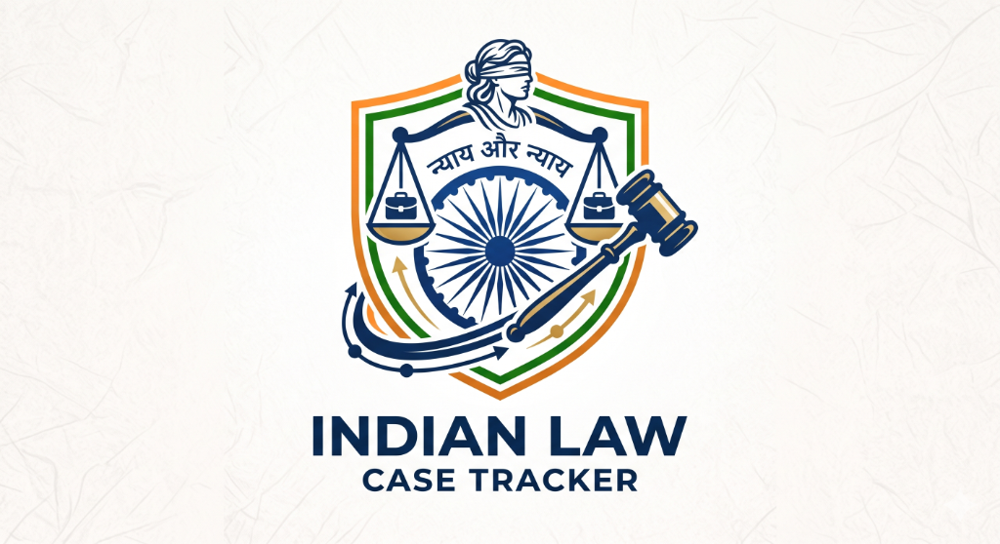
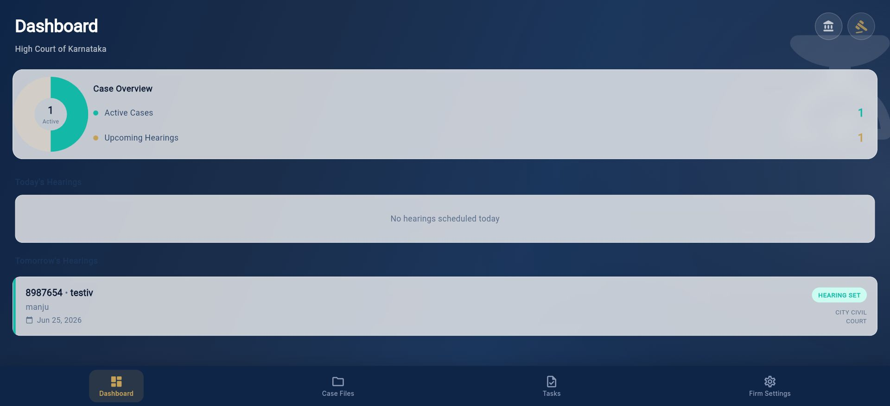

# CaseTrack ⚖️

<p align="center">
  
</p>

CaseTrack is a premium, neumorphic-styled mobile and web application designed for Indian legal practitioners to track court hearings, case outcomes, client details, and notes.



## Features 🚀

- **Premium Neumorphic UI**: A clean, modern aesthetic with rich depth perception, tactile cards, and micro-interactions.
- **Case Detail View**: A centralized timeline for rescheduled hearings, comprehensive case detail cards, and interactive outcome markers.
- **Smart Reminders**: Automated notifications configured to alert users the day before and the morning of scheduled hearings.
- **Cloud Synchronization**: Integrated Firebase Anonymous Authentication and Firestore backend for seamless data synchronization across multiple devices.
- **Robust Storage Fallback**: Secure local caching using `SharedPreferences` to enable full offline support.
- **Multiplatform Ready**: Standardized configurations for deployment on Android (Google Play), iOS (Apple App Store), and Web.

---

## Getting Started 🛠️

### Prerequisites
- [Flutter SDK](https://docs.flutter.dev/get-started/install) (v3.12.0 or higher)
- Android SDK (for Android emulation/testing)
- Google Chrome (for Web testing)

### Installation
1. Clone the repository:
   ```bash
   git clone https://github.com/your-username/casetrack.git
   cd casetrack
   ```
2. Install dependencies:
   ```bash
   flutter pub get
   ```

### Running the App
- **Run on Web**:
  ```bash
  flutter run -d chrome
  ```
- **Run on Connected Emulator/Device**:
  ```bash
  flutter run
  ```

---

## Running Automated Tests 🧪

To verify the database layer and Firestore syncing capabilities:
```bash
flutter test
```

---

## Release Configurations 📦

The project is pre-configured for production releases:
- **Android Package ID**: `com.casetrack.app` (configured in `build.gradle.kts`).
- **iOS Bundle ID**: `com.casetrack.app` (configured in `project.pbxproj`).
- **Web Hosting**: Pre-mapped to Firebase project `case-tracker-49cb5`.

For step-by-step instructions on deploying the web application and uploading the builds, refer to the [Publishing Guide](publishing_guide.md).
