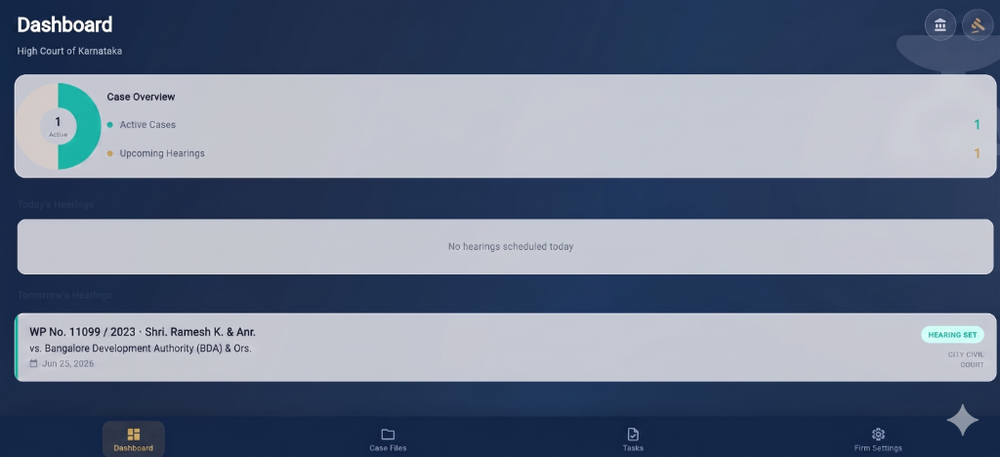

# CaseTrack ⚖️

<p align="center">
  
</p>

CaseTrack is a premium, neumorphic-styled mobile and web application designed for Indian legal practitioners to track court hearings, case outcomes, client details, and notes.



# ✨ Features

## Current Features

* **📋 Centralized Case Timeline**

  * View all case events in a chronological timeline.
  * Track rescheduled hearings, previous proceedings, and upcoming hearing dates.
  * Comprehensive case detail cards with interactive outcome markers for quick case history and progress tracking.

* **🔔 Intelligent & Customizable Hearing Reminders**

  * Receive automatic reminders **one day before** every scheduled hearing.
  * Receive a second reminder **on the hearing day** at a custom time before the hearing.
  * Fully customizable reminder schedules for each case.
  * Edit, reschedule, or disable reminders anytime.
  * Supports multiple reminders per case.

* **☁️ Cloud Synchronization**

  * Powered by Firebase Anonymous Authentication and Cloud Firestore.
  * Securely syncs case data across multiple devices.
  * Automatic cloud backup and real-time synchronization.

* **📱 Offline-First Architecture**

  * Local caching using SharedPreferences.
  * Full offline access to case information.
  * Automatically syncs changes once internet connectivity is restored.

* **🌐 Cross-Platform Support**

  * Android
  * iOS
  * Web
  * Single codebase with a consistent user experience.

* **⚡ Fast & Reliable Performance**

  * Optimized for quick data access.
  * Lightweight and responsive UI.
  * Designed for advocates, legal professionals, and clients.

* **🔒 Secure & Private**

  * Secure authentication.
  * Protected cloud storage.
  * Reliable data backup and synchronization.

---

# 🚀 Upcoming Features

* **🏛️ eCourts Integration**

  * Sync case details directly using CNR numbers.
  * Automatically fetch hearing dates, orders, and case status from supported eCourts services.
  * Reduce manual data entry and keep records up to date.

* **📄 Court Orders & Judgments**

  * Automatically retrieve and organize court orders and judgments.
  * Download and store documents within each case.

* **🤖 AI Case Assistant**

  * AI-powered summaries of case history.
  * Smart insights for upcoming hearings.
  * Natural language search across case records and notes.

* **📅 Calendar Integration**

  * Sync hearings with Google Calendar, Apple Calendar, and Outlook.
  * Receive reminders across all your devices.

* **👥 Team & Chamber Collaboration**

  * Share cases securely with junior advocates and office staff.
  * Assign tasks and manage permissions.

* **📝 Notes & Document Management**

  * Attach PDFs, images, and legal documents.
  * Organize hearing notes and evidence in one place.

* **📊 Case Analytics Dashboard**

  * View active, pending, disposed, and upcoming cases.
  * Track workload and hearing statistics.

* **🔍 Advanced Search & Filters**

  * Search by client name, advocate, court, judge, case number, or CNR number.
  * Powerful filters for faster case management.

* **💰 Fee & Payment Tracking**

  * Record client payments and outstanding balances.
  * Generate invoices and payment history.

* **🔔 Cause List Notifications**

  * Receive alerts when your cases appear in the daily cause list (where supported).

* **🌐 Multi-Language Support**

  * Support for English, Hindi, Kannada, Tamil, Telugu, and additional Indian languages.

* **📤 Import & Export**

  * Export case data to PDF, Excel, or CSV.
  * Import existing case records for quick onboarding.

* **🛡️ Enhanced Security**

  * Biometric authentication (Fingerprint/Face ID).
  * PIN protection.
  * End-to-end encrypted backups.

* **📈 Advocate Productivity Tools**

  * Daily task planner.
  * Client meeting reminders.
  * Hearing preparation checklist.
  * Office expense tracking.
  * Practice performance reports.

---

## Getting Started 🛠️

### Prerequisites
- [Flutter SDK](https://docs.flutter.dev/get-started/install) (v3.12.0 or higher)
- Android SDK (for Android emulation/testing)
- Google Chrome (for Web testing)

### Installation
1. Clone the repository:
   ```bash
   git clone https://github.com/your-username/casetrack.git
   cd casetrack
   ```
2. Install dependencies:
   ```bash
   flutter pub get
   ```

### Running the App
- **Run on Web**:
  ```bash
  flutter run -d chrome
  ```
- **Run on Connected Emulator/Device**:
  ```bash
  flutter run
  ```

---

## Running Automated Tests 🧪

To verify the database layer and Firestore syncing capabilities:
```bash
flutter test
```

---

## Release Configurations 📦

The project is pre-configured for production releases:
- **Android Package ID**: `com.casetrack.app` (configured in `build.gradle.kts`).
- **iOS Bundle ID**: `com.casetrack.app` (configured in `project.pbxproj`).
- **Web Hosting**: Pre-mapped to Firebase project `case-tracker-49cb5`.

For step-by-step instructions on deploying the web application and uploading the builds, refer to the [Publishing Guide](publishing_guide.md).
